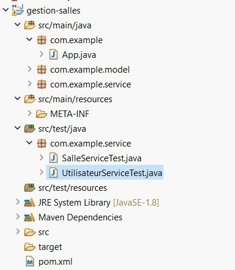
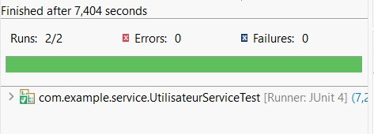

# Gestion des Salles — Hibernate JPA CRUD

Projet Java utilisant **Hibernate (JPA)** avec une base de données **H2 en mémoire** pour gérer des utilisateurs et des salles.

Ce projet démontre la mise en place d’une architecture CRUD avec des services génériques et des tests unitaires.

---

##  Technologies utilisées

-  Java 8
-  Maven
-  Hibernate / JPA
-  JUnit 4
-  Base de données H2 (in-memory)

---

##  Structure du projet

## Exécution CRUD

.jpeg)
.jpeg)
## Exécution des tests

# Test SalleService

.jpeg)

# Test UtilisateurService

.jpeg)

# gestion-salles
